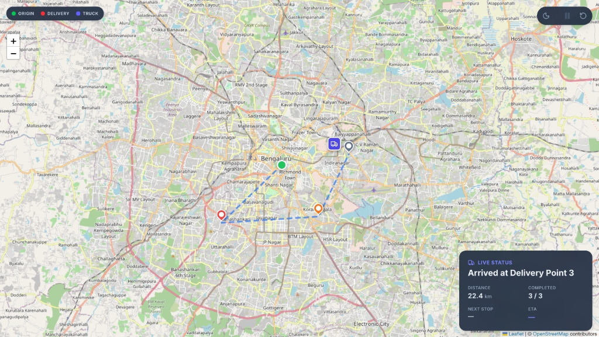

# Logistics Truck Route Visualizer

🔗 **[Live Demo](https://truck-route-visualizer-monodip.vercel.app/)**



A modern React application that visualizes a logistics truck's journey across multiple delivery points. Built with a focus on physics-based animation, clean architecture, and a custom UI aesthetic.

## 🌟 Key Features

- **Animation Logic**: Instead of standard point-to-point animations, the truck's speed is calculated using the **Haversine formula**. The truck travels at a proportional speed across legs of different lengths so it doesn't jump around.
- **Compact Dashboard**: A floating status panel built with Tailwind CSS v4, featuring a 2-column grid for live stats (Distance covered, ETA, Next Stop, and Progress).
- **Interactive Controls**: Users can **Pause**, **Resume**, and **Reset** the simulation at any point mid-route.
- **Dark Mode**: A custom CSS inversion filter (`filter: invert(1) hue-rotate(180deg)`) dynamically transforms standard OpenStreetMap tiles into a dark aesthetic, completely eliminating the need for third-party mapping API keys or watermarks.
- **Responsive & Minimalist**: Includes a pill-shaped control toolbar, minimal legend overlays, and perfectly offset markers that adapt to any screen size.

## 🛠️ Tech Stack

- **Framework**: React 19 + Vite
- **Styling**: Tailwind CSS v4 (with `Inter` typography)
- **Mapping**: `react-leaflet` + `leaflet` (OpenStreetMap standard tiles)
- **Icons**: `lucide-react`

## 📌 Assumptions

- Average truck speed assumed at 40 km/h for both ETA calculation and physics-based leg timing
- Simulation runs at accelerated speed for demo purposes (not real-time); relative speed remains proportional across legs
- Route coordinates (Origin, D1, D2, D3) are manually selected points around Bengaluru, not sourced from a live geocoding/routing API
- Truck position updates are simulated locally rather than fetched from a real backend/GPS feed, structured to mirror how real position-ping data would arrive

## 🚀 Getting Started

### Prerequisites
Make sure you have Node.js (v18+ recommended) installed.

### Installation

1. Clone the repository:
   ```bash
   git clone https://github.com/Ra-jj/Truck_Route_Visualizer-Assign-1-.git
   cd Truck_Route_Visualizer-Assign-1-
   ```

2. Install dependencies:
   ```bash
   npm install
   ```

3. Start the development server:
   ```bash
   npm run dev
   ```

4. Open your browser and navigate to `http://localhost:5173`.

## 🧠 Architectural Decisions

- **Component State**: The route simulation is decoupled from the UI rendering. `useTruckSimulation.js` acts as a state machine, running a 100ms interval tick that outputs where the truck should be. 
- **Effect Cleanup**: Leg-transition logic is isolated in specific `useEffect` hooks to handle React 19's StrictMode double-invocations without breaking the route index.
- **API-Key Free**: By using base OpenStreetMap tiles and applying CSS inversion for dark mode, the application remains entirely free and open-source without displaying `API KEY REQUIRED` watermarks from providers like CartoDB or Mapbox.
- **Performance**: Disabled aggressive Leaflet auto-panning to prevent the DOM map tile renderer from fighting the 100ms SVG interpolation updates, resulting in smooth movement.
- **Mobile Viewport Height**: Uses `100dvh` (dynamic viewport height) instead of `100vh` for the main layout, ensuring the full Status Panel remains visible on real mobile browsers without requiring a scroll—`100vh` alone doesn't correctly account for mobile browser address bar chrome.

## 📝 License
This project is open source and available under the [MIT License](LICENSE).
